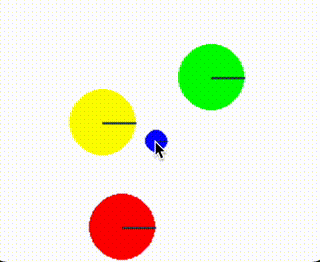

# Push2D-Simulator


[](https://github.com/psf/black)
[](https://github.com/astral-sh/ruff)



## Usage

### Install

```shell
poetry add git+https://github.com/nomutin/push2d-simulator.git
```

### Collect Data

```python
from push2d_simulator import Simulator

simulator = Simulator(config)
simulator.follow()
```

### Action Test

```python
from push2d_simulator import Simulator

simulator = Simulator(config)
for action in action_sequence:
    simulator.replay(action)
    current_observation = simulator.get_observation()
    current_action = simulator.get_action()
```

## References

- [Pymunk](http://www.pymunk.org/en/latest/)
- [BringBackShapes Environment](https://github.com/arnavkj1995/BBS)
